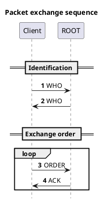

---
title: "Open Air POS"
subtitle:   |
            | Documentation
            |
            | PacketManager
            |
author: Nicolas Deleuze - Rodrigues Lejeune
date: "January 2025"
lang: "en"
titlepage: true
titlepage-rule-color: "1466d9"
titlepage-rule-height: 2
geometry:
  - top=2cm
  - bottom=2cm
  - left=1cm
  - right=1cm
numbersections: true
nocite: "@*"
...

\newpage

\tableofcontents

\newpage

\huge
Open Air POS - Documentation
\normalsize

# PacketManager

## PacketType

PacketType is an header used to identify what type of data are send.

```dart
enum PacketType {
  String,
  Order,
  Who,
  Ack
}
```

- String  
    is normally not used, but it's here for testing purpose.
- Order  
    is used to send an Order object.
- Who
    is used to make identification between two devices  
    in the future, it will be used to "*draw*" a map of the network,  
    in the case of a "*mesh*" network to generate routing table.
- Ack  
    is used to acknowledge a received packet by the id of the packet transmitted.


## Communication scenario

{ width=200px }


## Packet structure

```
|-----------|-----------|-------|-------|-------|
| recipent  | source    | id    | type  | data  |
|-----------|-----------|-------|-------|-------|
```
